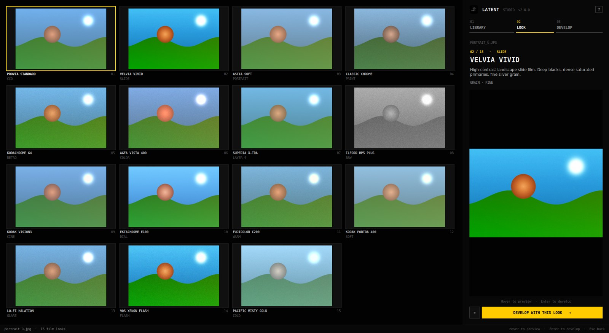

# Latent Studio

**Analog film emulation for CCD-era digital photographs.**
Pick a photo, compare it through 15 film stocks side by side, then fine-tune it on a grading workbench and export at full resolution.



---

## Download

| System | Download | How to run |
|---|---|---|
| **Windows 10/11** (recommended) | [**LatentStudio-Windows-Setup.exe**](https://github.com/geosubash-glitch/latentworkspaces-v1.0.15-CCDera/releases/latest/download/LatentStudio-Windows-Setup.exe) | Double-click, click **Install**. No admin rights needed. Creates Start menu + desktop shortcuts. |
| Windows (no install) | [LatentStudio-Windows-Portable.zip](https://github.com/geosubash-glitch/latentworkspaces-v1.0.15-CCDera/releases/latest/download/LatentStudio-Windows-Portable.zip) | Right-click → **Extract All**, open the folder, double-click **Latent Studio.exe**. Runs from a USB stick too. |
| macOS (Apple Silicon) | [LatentStudio-macOS.zip](https://github.com/geosubash-glitch/latentworkspaces-v1.0.15-CCDera/releases/latest/download/LatentStudio-macOS.zip) | Unzip, drag **Latent Studio** to Applications. First launch: right-click → **Open** → **Open** (the app is not notarised). |
| Linux x64 | [LatentStudio-Linux-x64.tar.gz](https://github.com/geosubash-glitch/latentworkspaces-v1.0.15-CCDera/releases/latest/download/LatentStudio-Linux-x64.tar.gz) | `tar xzf LatentStudio-Linux-x64.tar.gz` then run `"Latent Studio/Latent Studio"`. |

Nothing else is needed: Python and all libraries are bundled.

> **Windows SmartScreen:** because the installer is not code-signed, Windows may show *"Windows protected your PC"*. Click **More info → Run anyway**.

---

## Using Latent

1. **Library** – *Choose folder…* and pick a photo (double-click or Enter). The last folder is remembered.
2. **Look** – all 15 film stocks are rendered on your photo. Hover to preview large, double-click to develop.
3. **Develop** – tune the look, light, colour, tone curve, colour wheels, effects and calibration. Hold **Space** to compare with the original, scroll to zoom, press **C** to crop & rotate, **Ctrl+E** to export.

Edits are non-destructive: your original file is never changed. Going back to a photo in the same session restores its edits.

| Shortcut | Action |
|---|---|
| `Ctrl+O` | Choose folder |
| Arrow keys / `Enter` | Move selection / open |
| Hold `Space` | Before / after |
| Mouse wheel, drag | Zoom, pan |
| `Ctrl+0` | Fit to screen |
| `C` | Crop & rotate |
| `Ctrl+Z` / `Ctrl+Y` | Undo / redo |
| `Ctrl+E` | Export |
| `Esc` | Back one stage |
| `F11` / `F1` | Full screen / all shortcuts |

Slider tips: **double-click** a slider to reset it, **click its number** to type an exact value.

Supported files: JPEG, PNG, TIFF, WebP, BMP (read) · JPEG, PNG, TIFF (export, keeps camera EXIF).

---

## Run from source

Requires Python 3.9+ with Tk.

* **Windows:** double-click `Launch_Latent.bat`
* **macOS:** double-click `Launch Latent.command`
* **Linux:** `./launch.sh`

The launchers create a private `.venv` next to the code on first run. Manually:

```bash
python -m venv .venv && . .venv/bin/activate
pip install -r requirements.txt
python -m latent [folder-or-photo]
```

Run the tests with `pip install pytest && python -m pytest`.

## Making a release

Every push builds Windows, macOS and Linux packages in GitHub Actions (downloadable from the run's *Artifacts*).
To publish downloads for everyone:

1. Bump `__version__` in `latent/__init__.py`.
2. Either push a tag (`git tag v2.1.0 && git push origin v2.1.0`) or push a commit whose message contains `[release]`.

The workflow attaches the installer, portable zip, macOS and Linux builds to a GitHub Release. The download links above always point at the newest release.

## Project layout

```
latent/
  imaging/     film engines, 7-stage pipeline, scopes, file I/O (no UI code)
  ui/          library, look and develop stages, crop dialog, widgets
  app.py       window, navigation, undo, shortcuts
  workers.py   background rendering (never touches Tk off the main thread)
packaging/     PyInstaller spec and Windows installer script
docs/          design and maths documentation
tests/         pipeline and file I/O tests
```

See [docs/](docs/) for the maths behind each film stock and the pipeline, and [CHANGELOG.md](CHANGELOG.md) for what changed from v1.
