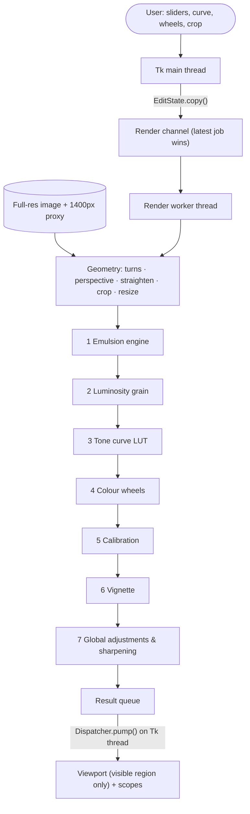

# LATENT // Pipeline Architecture & Technical Design

LATENT is a virtual darkroom: a 7-stage, non-destructive pipeline (`latent/imaging/pipeline.py`) that runs on a background thread while the Tk interface stays responsive. The stages translate the raw response of **CCD sensors** into film emulsion behaviour; every stage is computed from the pixels, with no overlays.

## 1. System architecture

## 2. Edit state

Everything that defines an edit is one plain dataclass, `EditState`: profile, per-profile parameters, global adjustments, calibration, curve points, wheel positions (unit disc) and a `Geometry`. It is cheap to copy, which gives us:

* **thread safety** — the worker gets its own copy; it never reads Tk variables;
* **undo/redo** — a stack of `EditState` snapshots, one per gesture (slider press, wheel drag, curve edit, crop apply);
* **per-photo memory** — switching photos stores the state and history for the session.

## 3. The stages

**Geometry** (`apply_geometry`) — quarter turns (`np.rot90`), keystone homography (`cv2.getPerspectiveTransform`), straighten with a *fill* scale
$s = \max\left(\cos\theta + \sin\theta\,\tfrac{h}{w},\ \cos\theta + \sin\theta\,\tfrac{w}{h}\right)$ so no black corners appear, crop in percent of the frame, optional resize. The preview proxy uses the same geometry with the resize scaled by `proxy_edge / full_edge`. The transformed proxy is cached until the geometry changes.

**1 — Emulsion engine.** The selected profile's function; see `filter_specifications.md`.

**2 — Luminosity grain.**
Weight by luma $y$: fine $0.4y + 0.1$, midtone $4y(1-y)$, heavy $1 - 0.3y$.
$I' = I + \mathcal{N}\cdot \tfrac{G}{2}\cdot W(y)$.
The noise field is **seeded** (stable while you drag sliders) and **resolution-independent**: it is generated at a 1200 px reference and upsampled for larger frames, then renormalised to unit variance. Grain therefore looks the same in the preview and in a 24 MP export, just as grain belongs to the negative rather than the scan. Monochrome stocks use a single-channel field.

**3 — Tone curve.** Natural cubic spline through the control points (tridiagonal system
$h_{i-1}c_{i-1} + 2(h_{i-1}+h_i)c_i + h_ic_{i+1} = 3\left(\tfrac{y_{i+1}-y_i}{h_i} - \tfrac{y_i-y_{i-1}}{h_{i-1}}\right)$),
evaluated once into a 256-entry LUT and applied with `cv2.LUT`. Skipped when the curve is the identity.

**4 — Colour wheels.** Wheel position $(r,\theta)$ becomes a BGR offset $r\cdot 50\cdot\cos(\theta-\theta_c)$ per primary ($\theta_R=\pi$, $\theta_G=-\pi/3$, $\theta_B=\pi/3$). The three offsets sum to zero, so the wheels shift hue without changing brightness. Applied with $W_s = (1-y)^2$, $W_h = y^2$, $W_m = 1 - W_s - W_h$.

**5 — Calibration.** $C' = C + S_C\,(C - \tfrac{1}{2}(\text{other two}))$, all computed from the original channels, so the order of the three adjustments doesn't matter.

**6 — Vignette.** $F = \text{clip}(1 + \tfrac{V}{100}d^2, 0, 2)$ with $d$ the normalised distance from centre (the distance map is cached per size).

**7 — Global.** Exposure (gain), temperature/tint (channel offsets), highlights/shadows ($y^2$ and $(1-y)^2$ masks), contrast about 127.5, saturation (HSV), and unsharp-mask sharpening whose radius scales with the frame size.

## 4. Threading model

* `workers.Dispatcher` — a queue drained by the Tk loop every 12 ms. Only the Tk thread touches widgets.
* `workers.Channel` — one worker thread per job type (develop render, look grid, previews, thumbnails, export, photo loading). `submit()` **replaces** any pending job, so fast slider drags coalesce into the newest state. Jobs get a cancel token (thumbnail and look-grid jobs stop early when you move on).
* Export runs the full-resolution pipeline on its own channel with a progress overlay; the UI stays usable.

## 5. Viewport

The develop viewport keeps a zoom factor (1 = fit) and an image-space centre. Each redraw crops only the visible region of the rendered proxy and resizes it to the screen, so zoom and pan never re-run the pipeline and never allocate a huge bitmap. Wheel zoom keeps the pixel under the cursor fixed; drag pans; double-click toggles fit ↔ 2.5×. Before/after swaps the display to the cached geometry-only image instantly.

## 6. File I/O

`latent/imaging/io.py` uses Pillow: Unicode paths work on Windows, EXIF orientation is applied, JPEG thumbnails decode at reduced size (`draft`) for speed, and exports carry the camera's EXIF block (orientation reset) and are written atomically (`.part` then rename).
