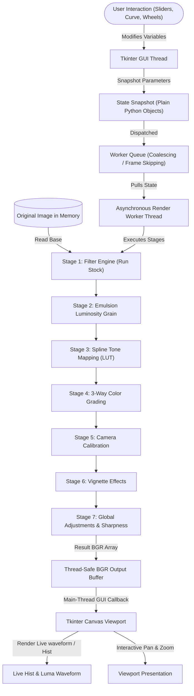

# LATENT // Pipeline Architecture & Technical Design

This document details the software architecture, mathematical equations, and threading pipeline of **LATENT**. The software is designed as a virtual darkroom that executes a 7-stage non-destructive rendering pipeline, offloaded asynchronously from the GUI thread to achieve maximum performance and stability.

This pipeline is specifically optimized to receive outputs from **CCD sensor cameras**. The mathematical operations in each stage (such as exposure curves, channel sat vectors, and calibration shifts) are designed to translate the unique raw responses of CCD sensors into mathematically authentic film emulsion simulations. Every step adheres to a function-formed design, calculating organic characteristics dynamically rather than applying arbitrary, ungrounded visual overlays.

---

## 1. System Architecture Diagram

The following Mermaid diagram illustrates the flow of image data, GUI parameters, and user events through the asynchronous rendering loops of LATENT:

---

## 2. The 7-Stage Image Processing Pipeline

Every change in the workbench triggers the following sequential pipeline, implemented in native C++ bindings via OpenCV (`cv2`) and optimized vectorized NumPy arrays.

### Stage 1: Filter Engine (Emulsion Emulation)
Pulls the selected film profile from the `FILTER_REGISTRY` and passes the source image through its dedicated profile function (e.g. `run_provia`, `run_velvia`, etc.).
- **Operation**: Custom matrix mapping, channel exposure scaling, or HSV saturation manipulation.
- **Mathematical Example (run_velvia)**:
  Apply contrast sigmoid curve, then saturate HSV:
  $$I_{32} = \frac{I_{BGR}}{255.0}$$
  $$I_{curve} = \frac{1.0}{1.0 + e^{-S \cdot (I_{32} - 0.5)}}$$
  $$I_{hsv} = \text{RGB2HSV}(I_{curve} \cdot 255.0)$$
  $$I_{hsv}[:,:,1] = \text{clip}(I_{hsv}[:,:,1] \cdot S_{boost}, 0, 255)$$
  $$I_{final} = \text{HSV2RGB}(I_{hsv})$$
  *(Where $S$ is the contrast slope parameter, and $S_{boost}$ is the saturation pop multiplier).*

### Stage 2: Emulsion Luminosity Grain
Applies simulated physical film grain by generating random distribution values scaled by a luminosity weight mask to match physical silver halide behavior (where grain is more visible in midtones or shadows rather than highlights).
- **vectorized Weighting**:
  - **Fine Grain (midtone)**:
    $$W(y) = 4.0 \cdot y \cdot (1.0 - y)$$
  - **Heavy Grain**:
    $$W(y) = 1.0 - 0.3 \cdot y$$
  - **Standard Grain**:
    $$W(y) = 0.4 \cdot y + 0.1$$
  *(Where $y \in [0, 1]$ represents the normalized channel pixel intensity).*
- **vectorized Addition**:
  $$\text{Noise} = G_{normal}(0, \sigma) \cdot W(y)$$
  $$I_{grain} = \text{clip}(I_{stage1} + \text{Noise}, 0, 255)$$
  Using NumPy broadcasting `raw_noise * weight[..., None]`, the grain calculation executes in a single native pass across all 3 color channels.

### Stage 3: Spline Tone Mapping (Cubic Spline LUT)
Constructs a cubic spline interpolation passing through the user-defined control points on the Tone Curve grid.
- **Mathematical Form**:
  Given $n+1$ points $x_0, x_1, \dots, x_n$ with values $y_0, y_1, \dots, y_n$, we solve the tridiagonal matrix equation:
  $$h_{i-1} c_{i-1} + 2(h_{i-1} + h_i) c_i + h_i c_{i+1} = 3 \left( \frac{y_{i+1} - y_i}{h_i} - \frac{y_i - y_{i-1}}{h_{i-1}} \right)$$
  for spline coefficients $c$, where $h_i = x_{i+1} - x_i$.
- **Performance Optimization**: Instead of running spline equations on every pixel during rendering (which would be $O(w \cdot h)$), the spline is pre-evaluated for all possible byte values $0 \dots 255$ into a Lookup Table (LUT). The image is mapped in $O(1)$ time complexity using OpenCV's hardware-accelerated mapping function:
  $$I_{curve} = \text{cv2.LUT}(I_{grain}, \text{LUT}_{spline})$$

### Stage 4: 3-Way Color Grading Offset
Applies shadow, midtone, and highlight chromatic offsets based on normalized Rec. 709 luminance values:
- **Luminance Extraction**:
  $$Y = 0.299 \cdot R + 0.587 \cdot G + 0.114 \cdot B$$
  $$Y_{norm} = \frac{Y}{255.0}$$
- **Weight Functions**:
  - Shadows weight: $W_s = (1.0 - Y_{norm})^2$
  - Highlights weight: $W_h = Y_{norm}^2$
  - Midtones weight: $W_m = 1.0 - W_s - W_h$
- **Color Displacement**:
  For each channel $C \in \{B, G, R\}$:
  $$I_{graded}[C] = I_{stage3}[C] + W_s \cdot \text{offset}_s[C] + W_m \cdot \text{offset}_m[C] + W_h \cdot \text{offset}_h[C]$$

### Stage 5: Camera Calibration
Calibrates primary sensor saturation responses by adjusting individual primary channel saturation vectors:
- **Channel Saturation Equations**:
  $$R_{diff} = R - 0.5 \cdot (G + B)$$
  $$R_{cal} = \text{clip}(R + S_R \cdot R_{diff}, 0, 255)$$
  $$G_{diff} = G - 0.5 \cdot (R + B)$$
  $$G_{cal} = \text{clip}(G + S_G \cdot G_{diff}, 0, 255)$$
  $$B_{diff} = B - 0.5 \cdot (R + G)$$
  $$B_{cal} = \text{clip}(B + S_B \cdot B_{diff}, 0, 255)$$
  *(Where $S_R, S_G, S_B$ are the saturation coefficients adjusted by the calibration sliders).*

### Stage 6: Vignette Effects
Applies radial lens falloff from the physical center of the sensor frame.
- **Vignette Equation**:
  $$d(x,y) = \frac{\sqrt{(x - x_c)^2 + (y - y_c)^2}}{d_{max}}$$
  $$F(x,y) = \text{clip}(1.0 + \frac{V_{strength}}{100.0} \cdot d(x,y)^2, 0.0, 2.0)$$
  For each channel:
  $$I_{vignette}(x,y) = I_{stage5}(x,y) \cdot F(x,y)$$

### Stage 7: Global Adjustments & Sharpness
Performs final grading, global adjustments, and local sharpening:
- **Exposure**: Multiplies channel values linearly.
- **Temperature & Tint**: Adjusts RGB channel offsets to push warmth (amber/blue) or tint (magenta/green).
- **Highlights & Shadows**: Isolates highlights and shadows using soft quadratic masks ($Y_{norm}^2$ and $(1 - Y_{norm})^2$) and shifts their values.
- **Contrast**: Scaled around the middle grey threshold ($127.5$):
  $$I_{contrast} = 127.5 + F_{contrast} \cdot (I_{global} - 127.5)$$
- **Sharpness**: Executes an unsharp mask using Gaussian blurring:
  $$\text{Blur} = \text{GaussianBlur}(I_{global}, k=5, \sigma=1.5)$$
  $$I_{sharp} = I_{global} + K_{sharp} \cdot (I_{global} - \text{Blur})$$

---

## 3. Threading & Asynchronous Concurrency Model

Running heavy computer vision operations on the main thread freezes the user interface, causing lag. LATENT isolates GUI and compute processes completely:

### Main GUI Thread
- Listens to user inputs, slider movements, and canvas interactions.
- Manages the state variables of the Tkinter application.
- Since Python's Tkinter bindings are not thread-safe on Windows, Tkinter widgets are **never** directly queried or updated from background threads.

### Snapshot Mechanism
- When a render is queued, the main thread makes a thread-safe **deep-copy** of all control variables (`self.snapshot_parameters()`) into a plain python tuple.
- This snapshot is sent to the background queue, allowing the user to immediately continue modifying sliders without race conditions.

### Background Render Thread (`_async_render_workbench_loop`)
- Runs a dedicated worker thread in a continuous loop:
  - If a newer state snapshot is in the queue, it discards any pending intermediate snapshots (**Frame Coalescing / Frame Skipping**). This keeps slider response at a steady 60fps.
  - Pulls the snapshot, executes the 7-stage pipeline on the source image, and stores the result BGR array.
  - Schedules a callback on the main thread via `.after()` to update the canvas widget.

---

## 4. Viewport Interactions & Geometric Transforms

The interactive workbench viewport supports standard digital assets operations.

### Perspective Keystone Warping
Calculates the perspective warp matrix to adjust vertical and horizontal geometric keystoning:
- Given shifts calculated from slider percentages:
  - Vertical Keystone shifts top or bottom edges horizontally.
  - Horizontal Keystone shifts left or right edges vertically.
- Generates source corner coordinates and maps them to distorted target corners.
- Calculates the homography matrix using `cv2.getPerspectiveTransform` and applies it with `cv2.warpPerspective`.

### Viewport Zoom and Pan Calculations
- **Panning**: Mouse drag with Right-Click tracks mouse delta movement. It uses Tkinter's native `scan_mark` and `scan_dragto` commands, offloading pan operations directly to native canvas scroll offsets.
- **Scroll Zoom**: Mouse scroll wheel centers zoom relative to the mouse pointer's coordinates:
  - Calculates the coordinates of the mouse cursor relative to the image canvas.
  - Scales the zoom factor logarithmically.
  - Adjusts scrollbars symmetrically so that the pixel directly under the cursor remains locked in place during zoom adjustments, avoiding disorienting viewport jumps.
